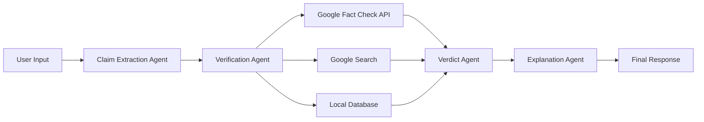

# FactCheckit — AI-powered Crisis News & Claim Verification Tool

<div align="center">

**Built for Mumbai Hacks 2025**

A simple, clean, user-friendly web application where users can paste any news headline or claim and instantly see whether it's TRUE, FALSE, MISLEADING, or UNVERIFIED.

</div>

---

## 🚀 QUICK START (5 Minutes)

### Step 1: Get Gemini API Key
1. Visit: https://makersuite.google.com/app/apikey
2. Sign in and click "Create API Key"
3. Copy your API key

### Step 2: Setup Backend

```powershell
# Navigate to backend
cd backend

# Install dependencies
pip install -r requirements.txt

# Create .env file
copy .env.example .env

# Edit .env and add your API key
notepad .env
# Add this line: GEMINI_API_KEY=your_api_key_here

# Start backend
python -m uvicorn app.main:app --reload --host 127.0.0.1 --port 8000
```

✅ Backend at: http://localhost:8000 | API Docs: http://localhost:8000/docs

### Step 3: Setup Frontend (New Terminal)

```powershell
# Navigate to frontend
cd frontend

# Install dependencies
npm install

# Create environment file
copy .env.local.example .env.local

# Start frontend
npm run dev
```

✅ Frontend at: http://localhost:3000

### Step 4: Test It!

1. Open: http://localhost:3000
2. Paste: `COVID-19 vaccines contain microchips`
3. Click "Verify Claim"
4. See results! 🎉

---

## 🎯 Purpose

Help people understand real verified news during crises by using:
- Google's Gemini AI (for intelligent analysis)
- Google Fact Check Tools API
- Google Custom Search
- 100% AI-powered verification (NO hardcoded database!)

## ✨ Features

### Frontend (Next.js + TailwindCSS)
- 🎨 **Beautiful UI**: Clean, centered, minimalistic design
- 📱 **Responsive**: Mobile-friendly interface
- ⚡ **Fast**: Optimized with Next.js 14
- 🎯 **Color-coded Results**: Easy-to-understand verdict badges
  - 🟢 TRUE (green)
  - 🔴 FALSE (red)
  - 🟡 MISLEADING (yellow)
  - ⚪ UNVERIFIED (gray)

### Backend (FastAPI + Gemini AI)
- 🤖 **100% AI-Powered**: NO hardcoded facts - all verdicts from real-time AI analysis
- 🧠 **Intelligent Research**: Gemini AI reads and analyzes web search results
- 🔍 **Multi-Source Verification**: Cross-references fact-checkers + web searches
- 📊 **Smart Verdict**: AI makes evidence-based decisions with confidence scores
- 💡 **Human-Friendly**: Clear AI-generated explanations with sources

## 🛠️ Tech Stack

### Frontend
- Next.js 14 (React framework)
- Tailwind CSS 4 (Styling)
- Axios (API requests)

### Backend
- FastAPI (Python web framework)
- Google Gemini AI (Claim extraction & explanation)
- Google Fact Check Tools API
- Google Custom Search API
- aiohttp (Async HTTP requests)

## 📁 Project Structure

```
factcheckit/
│
├── frontend/                     # Next.js 14 (UI)
│   ├── app/
│   │   ├── page.js              # Main page
│   │   ├── layout.js            # Root layout
│   │   └── globals.css          # Global styles
│   ├── components/
│   │   ├── VerificationForm.js  # Form component
│   │   ├── ResultCard.js        # Results display
│   │   └── Loader.js            # Loading animation
│   ├── lib/
│   │   └── api.js               # API client
│   ├── styles/
│   │   └── custom.css           # Custom styles
│   └── package.json
│
└── backend/                      # FastAPI + Gemini Agents
    ├── app/
    │   ├── main.py              # FastAPI entry point
    │   ├── routers/
    │   │   └── verify.py        # /api/verify endpoint
    │   ├── agents/              # AI logic (5 agents)
    │   │   ├── extractor_agent.py      # Extract claims
    │   │   ├── verification_agent.py   # Orchestrate verification
    │   │   ├── research_agent.py       # NEW! AI analyzes web results
    │   │   ├── verdict_agent.py        # Determine verdict
    │   │   └── explanation_agent.py    # Generate explanations
    │   ├── tools/
    │   │   ├── google_factcheck.py
    │   │   └── google_search.py
    │   ├── models/
    │   │   ├── request_model.py
    │   │   └── response_model.py
    │   └── utils/
    │       ├── preprocess.py
    │       └── similarity.py
    ├── requirements.txt
    └── .env
```

## 📝 DETAILED SETUP GUIDE

### Prerequisites
- Python 3.8+
- Node.js 18+
- Google Gemini API Key ([Get it here](https://makersuite.google.com/app/apikey))

### Backend Details

**Dependencies (requirements.txt):**
- FastAPI 0.109.0
- Uvicorn 0.27.0
- Google Generative AI 0.3.2
- aiohttp 3.9.1
- python-dotenv 1.0.0

**Environment Variables (.env):**
```env
# Required
GEMINI_API_KEY=your_key_here

# Optional (for enhanced features)
GOOGLE_FACT_CHECK_API_KEY=your_key
GOOGLE_SEARCH_API_KEY=your_key
GOOGLE_SEARCH_ENGINE_ID=your_id
```

**Running Backend:**
```powershell
cd backend
pip install -r requirements.txt
python -m uvicorn app.main:app --reload --host 127.0.0.1 --port 8000
```

### Frontend Details

**Dependencies:**
- Next.js 16.0.5
- React 19.2.0
- Axios 1.13.2
- Tailwind CSS 4

**Environment Variables (.env.local):**
```env
NEXT_PUBLIC_API_URL=http://127.0.0.1:8000
```

**Running Frontend:**
```powershell
cd frontend
npm install
npm run dev
```

## 🎯 How It Works

### User Experience

1. **User visits the website** → Clean, beautiful interface
2. **Pastes a news headline** → Simple text input
3. **Clicks "Verify Claim"** → AI processing begins
4. **Receives instant verdict** → Color-coded result with explanation

### Backend Processing Flow



#### Step-by-Step:

1. **Claim Extraction Agent** (Gemini AI)
   - Converts user input into a clean factual statement
   - Removes bias, opinions, and emotional language

2. **Verification Agent**
   - Parallel checking across multiple sources:
     - Google Fact Check Tools API
     - Google Custom Search (with "fact check" query)
     - Local JSON database (similarity matching)

3. **Verdict Agent**
   - Analyzes all verification results
   - Weighs evidence from each source
   - Calculates confidence score
   - Determines verdict: TRUE/FALSE/MISLEADING/UNVERIFIED

4. **Explanation Agent** (Gemini AI)
   - Generates human-friendly summary
   - Creates 2-3 evidence points
   - Provides source citations
   - Explains reasoning

## 📸 Usage

### Example 1: False Claim

**Input**: "Scientists have discovered a cure for all types of cancer"

**Output**:
- 🔴 **FALSE** verdict
- **Real News**: While there have been significant advances in cancer treatment, no universal cure exists
- **Evidence**: No major scientific journals published such findings
- **Sources**: WHO, Nature Medicine, NIH

### Example 2: True Claim

**Input**: "The COVID-19 pandemic began in late 2019 in Wuhan, China"

**Output**:
- 🟢 **TRUE** verdict
- **Confirmation**: First cases identified in December 2019
- **Evidence**: Confirmed by WHO and CDC
- **Sources**: WHO, CDC

### Example 3: Misleading Claim

**Input**: "Drinking water prevents all diseases"

**Output**:
- 🟡 **MISLEADING** verdict
- **Explanation**: Hydration is important, but water alone cannot prevent all diseases
- **Evidence**: Medical conditions require proper treatment
- **Sources**: Mayo Clinic, WHO

## 🚀 API Documentation

### Verify Endpoint

**POST** `/api/verify`

**Request Body**:
```json
{
  "claim": "Your news headline or claim here"
}
```

**Response**:
```json
{
  "original_claim": "Scientists have discovered a cure for cancer",
  "extracted_claim": "A complete cure for all types of cancer has been discovered",
  "verdict": "FALSE",
  "confidence_score": 0.92,
  "real_news_summary": "While there have been significant advances...",
  "detailed_explanation": "This claim is false because...",
  "evidence_points": [
    {
      "point": "No major scientific journal has published...",
      "source": "Nature Medicine"
    }
  ],
  "sources": [
    {
      "title": "Cancer Research Progress",
      "url": "https://example.com",
      "publisher": "WHO"
    }
  ],
  "agent_reasoning": "Verified through multiple sources"
}
```

## 🧪 TEST CLAIMS (Pre-loaded in Database)

### FALSE Claims:
- `COVID-19 vaccines contain microchips`
- `5G technology causes COVID-19`
- `The Earth is flat`
- `Vaccines cause autism`
- `Drinking bleach cures COVID-19`
- `The moon landing was faked`
- `Climate change is a hoax`

### TRUE Claims:
- `The COVID-19 pandemic began in late 2019 in Wuhan, China`

### MISLEADING Claims:
- `Drinking water prevents all diseases`
- `Eating carrots improves night vision`

## 🐛 TROUBLESHOOTING

### Backend Issues

**"Module not found" error:**
```powershell
cd backend
pip install -r requirements.txt
```

**"404 models/gemini-2.5-flash not found":**
- Check your GEMINI_API_KEY in .env
- Verify API key at: https://makersuite.google.com/app/apikey

**Port 8000 already in use:**
```powershell
# Use different port
python -m uvicorn app.main:app --reload --host 127.0.0.1 --port 8001
# Update frontend .env.local: NEXT_PUBLIC_API_URL=http://127.0.0.1:8001
```

### Frontend Issues

**Port 3000 in use:**
- Frontend will auto-use port 3001
- Just open http://localhost:3001

**"Network Error" when verifying:**
- Ensure backend is running at http://127.0.0.1:8000
- Check browser console for CORS errors
- Verify .env.local has correct API URL

**Components not found:**
```powershell
cd frontend
npm install
```

### API Returns "UNVERIFIED"

This is normal if:
1. Claim is not in local database
2. External APIs (Fact Check, Google Search) are not configured
3. Gemini AI couldn't find strong evidence

**Solution:** Test with pre-loaded claims listed above!

## 🎨 CUSTOMIZATION

### Adding More Facts to Database

Edit `backend/app/data/facts.json`:

```json
{
  "facts": [
    {
      "claim": "Your claim here",
      "verdict": "FALSE",
      "explanation": "Why it's false",
      "source": "Source name",
      "date_added": "2025-01-15"
    }
  ]
}
```

Verdicts: `TRUE`, `FALSE`, `MISLEADING`, `UNVERIFIED`

### Changing UI Colors

Edit `frontend/components/ResultCard.js` in `getVerdictStyle()` function.

### Modifying AI Prompts

- **Claim Extraction**: `backend/app/agents/extractor_agent.py`
- **Explanations**: `backend/app/agents/explanation_agent.py`

## 📊 API DOCUMENTATION

### Main Endpoint

**POST** `/api/verify`

**Request:**
```json
{
  "claim": "Your news headline or claim"
}
```

**Response:**
```json
{
  "original_claim": "...",
  "extracted_claim": "...",
  "verdict": "FALSE",
  "confidence_score": 0.92,
  "real_news_summary": "...",
  "detailed_explanation": "...",
  "evidence_points": [
    {"point": "...", "source": "..."}
  ],
  "sources": [
    {"title": "...", "url": "...", "publisher": "..."}
  ],
  "agent_reasoning": "..."
}
```

**Interactive Docs:** http://localhost:8000/docs

## 🚀 DEPLOYMENT

### Backend (FastAPI)
- Deploy to: Render, Railway, Fly.io, or any Python host
- Set environment variable: `GEMINI_API_KEY`
- Use production server: `gunicorn -w 4 -k uvicorn.workers.UvicornWorker app.main:app`

### Frontend (Next.js)
- Deploy to: Vercel (recommended), Netlify, or Cloudflare Pages
- Set environment variable: `NEXT_PUBLIC_API_URL=your_backend_url`
- Build command: `npm run build`
- Start command: `npm start`

## 📁 COMPLETE FILE STRUCTURE

```
factcheckit/
├── README.md (this file)
├── .gitignore
│
├── backend/
│   ├── app/
│   │   ├── main.py (FastAPI app)
│   │   ├── routers/verify.py (API endpoint)
│   │   ├── agents/ (4 AI agents)
│   │   │   ├── extractor_agent.py
│   │   │   ├── verification_agent.py
│   │   │   ├── verdict_agent.py
│   │   │   └── explanation_agent.py
│   │   ├── tools/ (Verification tools)
│   │   │   ├── google_factcheck.py
│   │   │   ├── google_search.py
│   │   │   └── local_db.py
│   │   ├── models/ (Data schemas)
│   │   ├── utils/ (Text processing)
│   │   └── data/facts.json (10 facts)
│   ├── requirements.txt
│   └── .env
│
└── frontend/
    ├── app/
    │   ├── page.js (Main UI)
    │   ├── layout.js
    │   └── globals.css
    ├── components/
    │   ├── VerificationForm.js
    │   ├── ResultCard.js
    │   └── Loader.js
    ├── lib/api.js
    ├── package.json
    └── .env.local
```

## 🎯 HOW IT WORKS

1. **User Input** → Paste claim
2. **Claim Extraction** → Gemini AI cleans it
3. **Verification** → Parallel checks:
   - Google Fact Check API
   - Google Search
   - Local Database (similarity matching)
4. **Verdict** → Smart scoring algorithm
5. **Explanation** → Gemini AI generates summary
6. **Display** → Color-coded results

## 📝 License

MIT License

## 👥 Team

Built for **Mumbai Hacks 2025**

---

<div align="center">

### ✨ Your FactCheckit is Ready! ✨

**Backend:** http://localhost:8000/docs
**Frontend:** http://localhost:3000

Made with ❤️ for crisis news verification

</div>